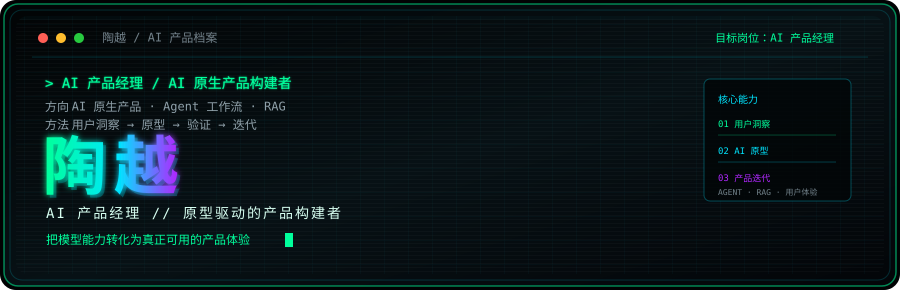

  

<h3 align="center">陶越｜AI 产品经理方向</h3>

  把用户问题、模型能力与产品目标连接成可验证的解决方案。

  <code>用户洞察</code>&nbsp;·&nbsp;<code>AI 产品架构</code>&nbsp;·&nbsp;<code>Agent 工作流</code>&nbsp;·&nbsp;<code>快速原型</code>

## `精选 AI 产品案例`

| 项目 | 解决的问题 | 核心方案 | 能力证明 |
|---|---|---|---|
| [AI 推理游戏](https://github.com/Tao716/ai-mini-game) | 纯聊天式 AI 游戏操作弱、状态不可控 | 用可点击地图、人物卡和线索板承载交互；模型负责理解与叙事，工具负责确定性状态和胜负规则 | 产品原型、Agent Loop、能力边界设计 |
| [小红书 AI 搜索架构分析](https://github.com/Tao716/xiaohongshu) | 公开页面难以说明完整产品与系统关系 | 基于证据拆解用户链路、产品能力、数据流和风险，明确区分事实、推断、建议与未知项 | 产品逆向、架构表达、风险判断 |
| [LibTV AI 创作产品分析](https://github.com/Tao716/libtv) | AI 创作工具的 Agent、资产与任务关系复杂 | 还原 As-Is 架构，并提出工作流状态、资产版本、计费与治理的 To-Be 方案 | AI 工作流、数据建模、系统性思考 |
| [活人感中文写作 Skill](https://github.com/Tao716/human-writing-skill) | AI 中文写作容易空泛、重复且缺少事实边界 | 建立材料检查、文体路由、事实核验、多轮改稿和质量检查规则 | Skill 设计、质量标准、提示策略 |

## `我的产品方法`

`发现问题` → `定义需求` → `拆解能力边界` → `制作原型` → `验证与迭代`

- **先确认用户价值**：明确目标用户、核心场景和需要解决的真实问题。
- **再设计 AI 边界**：区分模型擅长的理解与生成，以及工具必须保证的状态、规则和结果。
- **用原型降低不确定性**：通过可运行 Demo、架构图和任务流程验证产品假设。
- **以证据推动迭代**：区分事实、推断和建议，不用未经验证的数据包装结果。

## `能力与工具`

  
  
  
  

  
<code>查看贡献图动画</code>

   
  

    <picture>
      <source media="(prefers-color-scheme: dark)" srcset="https://raw.githubusercontent.com/Tao716/Tao716/output/github-contribution-grid-snake-dark.svg" />
      <source media="(prefers-color-scheme: light)" srcset="https://raw.githubusercontent.com/Tao716/Tao716/output/github-contribution-grid-snake.svg" />
      
    </picture>
  

